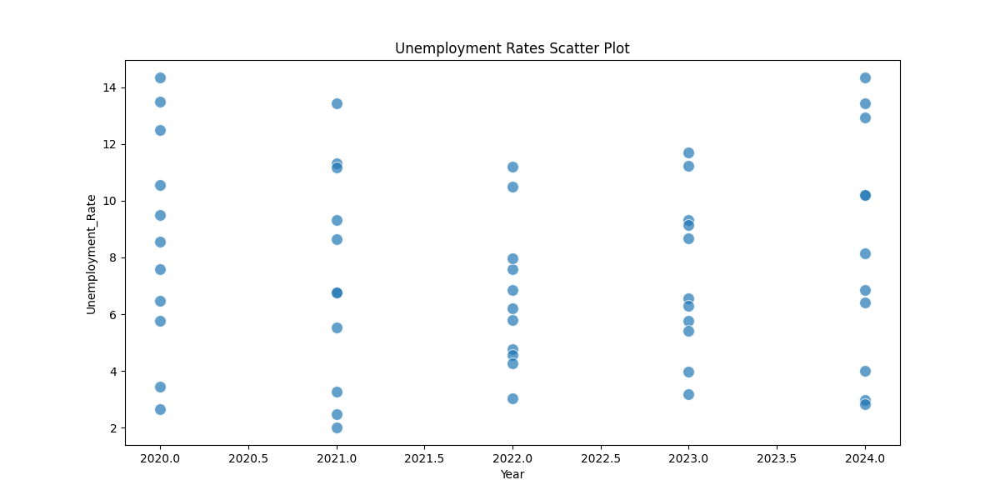
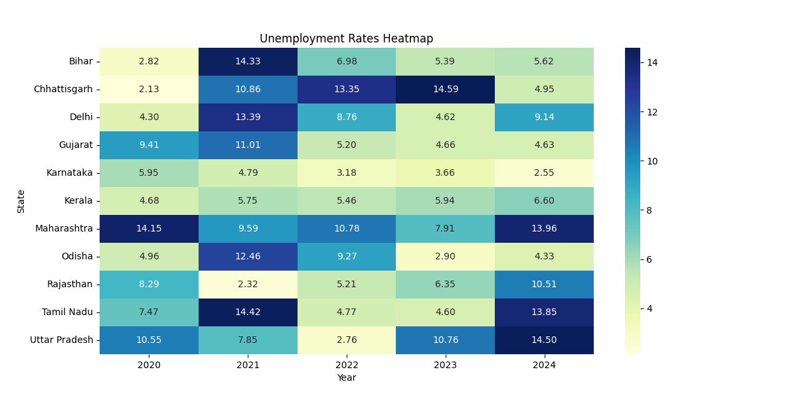
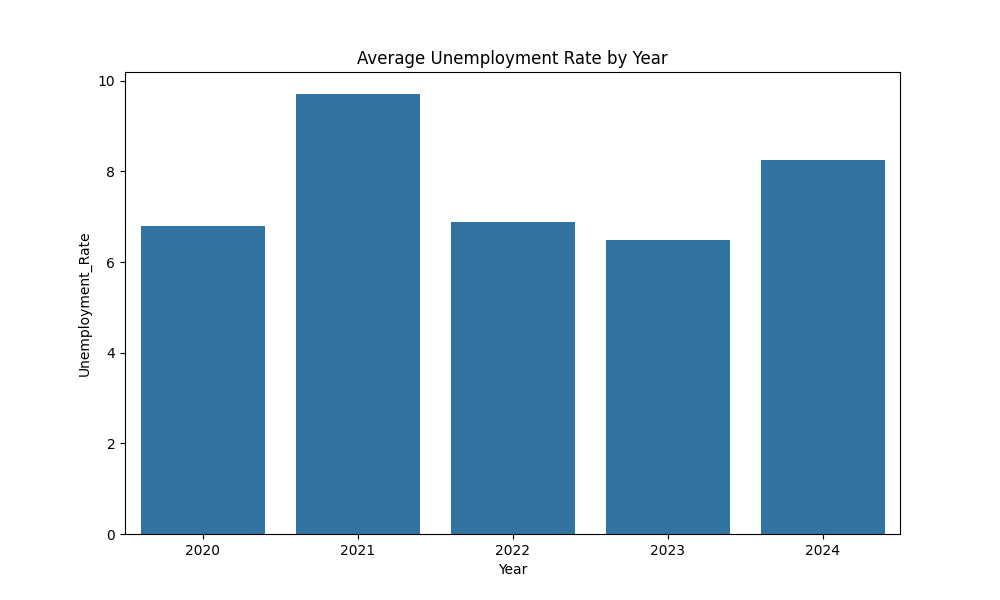

# 📊 Unemployment Data Analysis (Python Project)

In this project, I have worked on **generating unemployment data** for multiple Indian states (2020–2024), performed **statistical analysis**, and created **visualizations** to understand patterns and trends.  

This project is a part of my **data analysis learning journey** and demonstrates how to handle data with **Pandas**, create meaningful insights with **statistics**, and visualize data using **Seaborn** and **Matplotlib**.  

---

## 🚀 Key Highlights  
- 🔢 **Data Generation** → Random unemployment rates (2%–15%) for different states and years  
- 📈 **Statistical Analysis** → Mean, Median, Mode, Min, Max, Variance, Standard Deviation, Correlation  
- 📂 **Data Export** → Saves raw dataset and statistical summary in CSV format  
- 🎨 **Visualizations** → Multiple plots for trend analysis and comparisons  

---

## 📂 Output Files  
- 📄 **CSV Files**  
  - `unemployment_data.csv` → Dataset with unemployment rates  
  - `stats_summary.csv` → Statistical summary of the dataset  

- 🖼️ **Visualization Images** (saved automatically in the project folder)  
  - `barplot_unemployment.png`  
  - `heatmap_unemployment.png`  
  - `scatter_unemployment.png`

  ---

## 📊 Sample Visualizations  

### 🔵 Scatter Plot  
  

### 🌡️ Heatmap  
  

### 📉 Bar Plot  
  

---
## 🛠️ Tech Stack  
- 🐍 **Python** – Core language  
- 📊 **Pandas** – Data manipulation and CSV handling  
- 🎨 **Matplotlib & Seaborn** – Data visualization

---
## 📌 Insights  
- This project demonstrates how **synthetic data can be generated, analyzed, and visualized**.  
- 🔹 Visualizations provide **clear insights** into unemployment patterns and trends  
- A useful practice project for **Exploratory Data Analysis (EDA)** and visualization skills.  

---

✨ Always open to feedback and improvements!  
